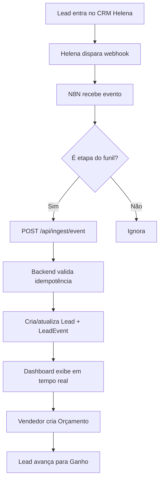

# Visão Geral — Dashboard Fabricante iGUi

## O Problema

A iGUi Piscinas possui uma rede de franquias espalhadas pelo Brasil. O **fabricante** (gestor regional/nacional) precisa acompanhar o desempenho comercial de cada loja em tempo real, identificar gargalos no funil de vendas e comparar o desempenho entre lojas.

Antes deste dashboard, esse acompanhamento era manual e fragmentado.

## A Solução

Um dashboard SaaS centralizado que:
1. **Ingere eventos** do CRM Helena via webhooks (N8N como middleware)
2. **Processa e armazena** o histórico de leads com event sourcing
3. **Visualiza KPIs** em tempo real com comparativos de período
4. **Ranqueia lojas** por performance e detecta gargalos automaticamente
5. **Gera orçamentos** em PDF com catálogo de piscinas integrado

## Personas de Usuário

### Fabricante / Admin
- Vê **todas as lojas** de uma vez
- Compara desempenho entre lojas
- Define metas de vendas
- Gerencia usuários e acessos

### Lojista
- Vê apenas **suas lojas**
- Gerencia vendedores da loja
- Acompanha leads e orçamentos

### Vendedor
- Vê apenas **seus próprios leads**
- Cria e gerencia orçamentos
- Acompanha sua meta mensal

### Analista CRM
- Acesso de **leitura** ao Trackeamento
- Sem acesso a configurações

## Fluxo Principal

## Diferenciais Técnicos

- **Event sourcing** no modelo de leads (cada transição é imutável)
- **Idempotência** por SHA-256 — webhook pode reenviar sem duplicar dados
- **Multi-tenant** via slug — preparado para múltiplos fabricantes
- **Modo dual** no frontend — funciona sem backend (mock data)
- **First-touch UTM attribution** — origem do lead nunca é sobrescrita

## Links Relacionados

- [[Stack Tecnológica]]
- [[Funil de Vendas]]
- [[Rotas da API]]
- [[Deploy e Infraestrutura]]
- [[Roadmap]]
