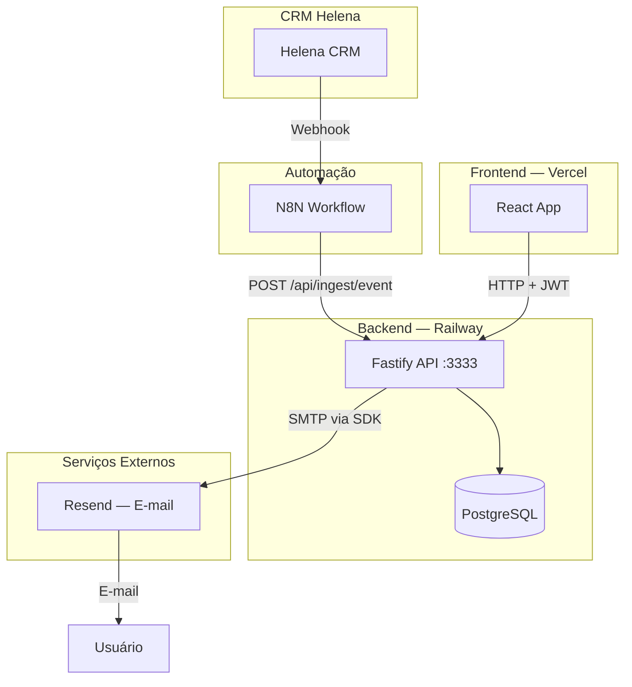

# Mapa da Arquitetura

## Visão de Alto Nível

## Camadas

| Camada | Tecnologia | Responsabilidade |
|--------|-----------|-----------------|
| Apresentação | React + Tailwind | UI, gráficos, formulários |
| Estado | React Context + hooks | Cache local, sincronização |
| HTTP Client | `src/lib/api.ts` | Todas as chamadas ao backend |
| API | Fastify routes | Validação, autorização, lógica |
| Domínio | Services internos | KPIs, funil, alertas, ingest |
| Persistência | Prisma + PostgreSQL | Armazenamento de dados |
| Infraestrutura | Railway + Vercel | Deploy, TLS, scaling |

## Notas Relacionadas

- [[Sistema de Autenticação]]
- [[Rotas da API]]
- [[Schema do Banco de Dados]]
- [[Componentes do Frontend]]
- [[Integração N8N e Helena CRM]]
