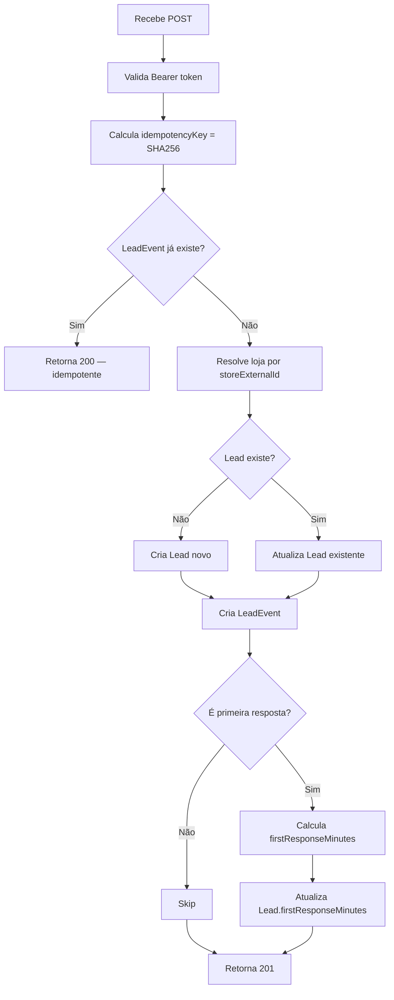

# Rota de Ingest — Webhook de Eventos CRM

## Responsabilidade

Recebe eventos de mudança de etapa de lead vindos do N8N (que por sua vez os recebe do Helena CRM). É o ponto de entrada de todos os dados de leads no sistema.

**Arquivo:** `backend/src/routes/ingest.ts`

## Endpoint

```
POST /api/ingest/event
Authorization: Bearer <WEBHOOK_SECRET>
```

## Payload Esperado

```json
{
  "leadExternalId": "string — ID do lead no CRM",
  "storeExternalId": "string — ID da loja no CRM",
  "toStage": "string — chave da etapa destino",
  "fromStage": "string? — chave da etapa origem (opcional)",
  "occurredAt": "ISO 8601",
  "eventId": "string — ID único do evento no CRM",
  "contactName": "string?",
  "contactPhone": "string?",
  "salespersonCrmId": "string?",
  "revenue": "number?",
  "utmSource": "string?",
  "utmMedium": "string?",
  "utmCampaign": "string?",
  "utmContent": "string?"
}
```

## Fluxo de Processamento



## Idempotência

**Chave:** `SHA-256(eventId + leadExternalId + toStage + occurredAt)`

Se o mesmo evento for recebido duas vezes (reenvio do N8N), o segundo é ignorado silenciosamente com status 200.

Eventos com falha são registrados na tabela `FailedEvent` para revisão manual.

## First Response Time

Calculado automaticamente quando:
- `fromStage.key === "lead_capturado"` (primeira transição após captura)
- `Lead.firstResponseMinutes` ainda é `null`

Fórmula: `(occurredAt - Lead.enteredAt) / 60` em minutos

## First-touch UTM Attribution

UTMs são escritos **apenas no primeiro evento** para um lead:
```typescript
if (!existingLead?.utmSource) {
  // escreve utmSource, utmMedium, utmCampaign, utmContent
}
```

Não sobrescreve UTMs de eventos posteriores.

## Tabela de Falhas

Se o processamento falhar (loja não encontrada, etapa inválida), o payload é salvo em `FailedEvent` com o erro para resolução manual.

## Segurança

- Autenticação por Bearer token (`WEBHOOK_SECRET`)
- Sem JWT de usuário — é um endpoint de sistema para sistema
- Rate limiting via `@fastify/rate-limit`
