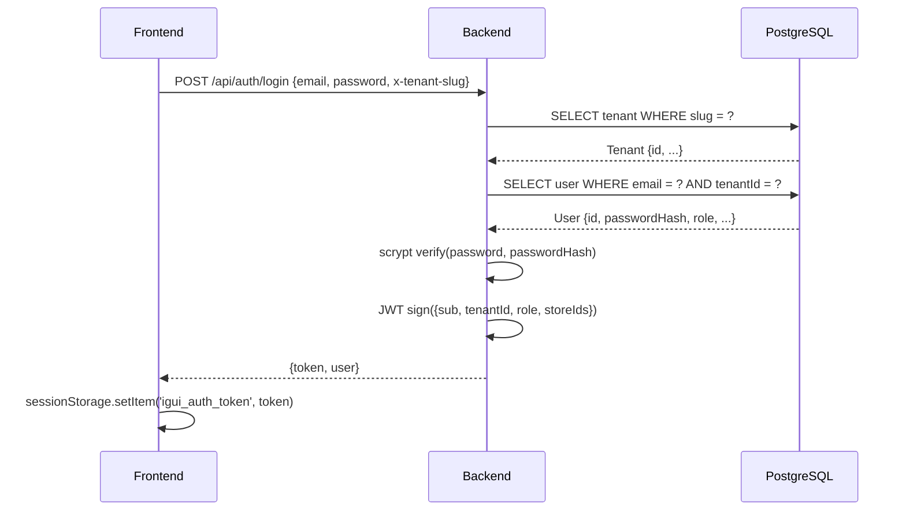
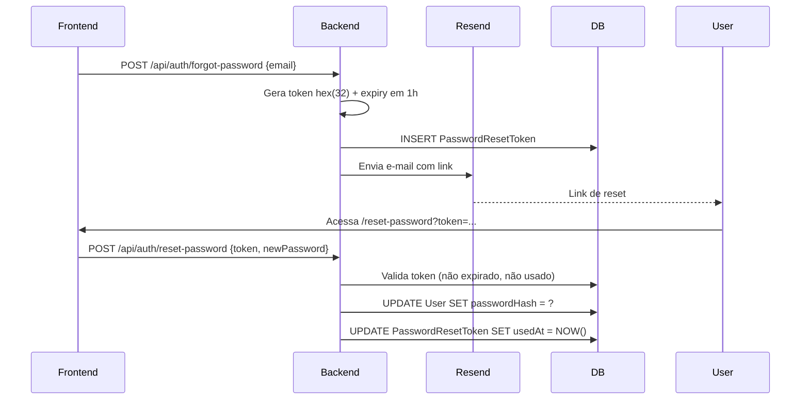

# Sistema de Autenticação

## Fluxo de Login



## JWT

| Campo | Valor |
|-------|-------|
| Algoritmo | HS256 |
| Expiração | 7 dias |
| Library | `jose` |
| Segredo | `JWT_SECRET` (mín. 32 chars) |

**Payload:**
```json
{
  "sub": "userId (UUID)",
  "tenantId": "UUID",
  "tenantSlug": "igui",
  "role": "admin | fabricante | lojista | vendedor | analista_crm",
  "storeIds": ["UUID", "..."]
}
```

## Armazenamento no Frontend

| Chave | Valor |
|-------|-------|
| `igui_auth_token` | JWT token |
| `igui_auth_user` | User DTO serializado |

**Armazenamento:** `sessionStorage` (apagado ao fechar o browser)

## Headers

```
Authorization: Bearer <token>
x-tenant-slug: igui
```

O `x-tenant-slug` é obrigatório apenas no login. Após o login, o `tenantId` vem do JWT.

## Hashing de Senha

- Algoritmo: Node.js `crypto.scrypt`
- Formato armazenado: `salt:hash` (hex, 64 bytes)
- Comparação: timing-safe via `crypto.timingSafeEqual`

## Reset de Senha



## Middleware de Autorização

```typescript
// Hierarquia de acesso
requireAdmin          // somente role = admin
requireAdminOrLojista // admin | lojista
requireAdminOrFabricante // admin | fabricante
requireAuth           // qualquer role autenticado
```

## Sistema de Permissões por Role

- [[Sistema de Permissões por Role]]
