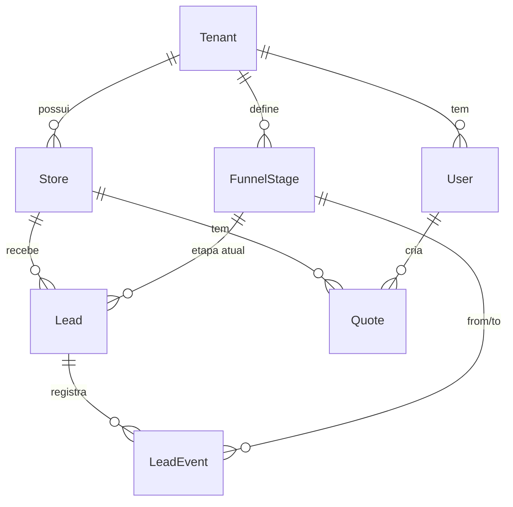

# Mapa do Banco de Dados

## Tecnologias

- **PostgreSQL 16**
- **Prisma 5 ORM** — migrations, tipagem, client singleton
- **Raw SQL** via `$queryRaw` para agregações complexas
- **Docker local:** `docker-compose.yml` (porta 5432, db: `igui_dashboard`)

## Schema Completo — Modelos

| Modelo | Notas |
|--------|-------|
| [[Modelo — Tenant]] | Raiz multi-tenant |
| [[Modelo — Store]] | Loja/franquia |
| [[Modelo — Lead]] | Lead individual |
| [[Modelo — LeadEvent]] | Event sourcing de transições |
| [[Modelo — FunnelStage]] | Definição das etapas |
| [[Modelo — User]] | Usuário do sistema |
| [[Modelo — Quote]] | Orçamento |
| [[Modelo — PasswordResetToken]] | Reset de senha |
| [[Modelo — FailedEvent]] | Falhas no ingest |

## Diagrama de Relacionamentos



## Arquivo do Schema

**Caminho:** `backend/prisma/schema.prisma`

## Comandos

```bash
cd backend

# Criar nova migration
npx prisma migrate dev --name nome_da_migration

# Aplicar migrations em produção
npx prisma migrate deploy

# Abrir GUI do banco
npx prisma studio

# Regenerar client após schema change
npx prisma generate

# Seed inicial
npx tsx src/seed.ts
```
