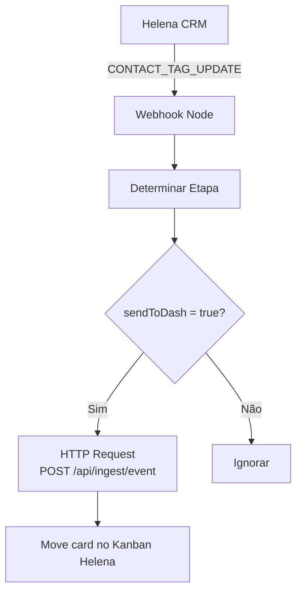

# Integração N8N e Helena CRM

## Arquivo

`N8N Finalizado.json` — importar diretamente no N8N.

## Arquitetura do Workflow



## Nós do Workflow

### 1. Webhook Helena
- Recebe evento `CONTACT_TAG_UPDATE` da Helena
- Cada store tem seu próprio workflow com URL única

### 2. Determinar Etapa
- Mapeia UUID de tag da Helena → `dashKey` (chave do funil)
- Define `sendToDash: true/false` por etapa
- Configura `stepId` da Helena para mover o card

**STAGE_MAP** (configuração por workflow):
```json
[
  { "tagId": "uuid-da-tag", "dashKey": "lead_capturado", "stepId": 123, "sendToDash": true },
  { "tagId": "uuid-outra", "dashKey": "visita_agendada", "stepId": 124, "sendToDash": true }
]
```

### 3. HTTP Request → Ingest
```
POST https://sua-api.railway.app/api/ingest/event
Authorization: Bearer <WEBHOOK_SECRET>
Content-Type: application/json

{
  "leadExternalId": "{{ contact.id }}",
  "storeExternalId": "{{ STORE_EXTERNAL_ID }}",
  "toStage": "{{ dashKey }}",
  "occurredAt": "{{ $now.toISO() }}",
  "eventId": "{{ $executionId }}",
  "contactName": "{{ contact.name }}",
  "contactPhone": "{{ contact.phone }}"
}
```

## Campos Extraídos do Card Helena

O **node-5 (Extrair Card ID)** busca os seguintes dados do card e os envia ao dashboard:

| Campo | Origem no Card Helena | Campo no Dashboard |
|-------|----------------------|-------------------|
| Nome do contato | `card.contact.name` / `firstName + lastName` | `contactName` |
| Telefone | `card.contact.phone` / `phones[0].phone` | `contactPhone` |
| Vendedor (email) | `card.assignedUser.email` | `salespersonCrmId` |
| Vendedor (nome) | `card.assignedUser.name` | `salespersonName` |
| Valor convertido | `card.monetaryAmount` / `card.value` | `revenue` (somente em `pagamento_aprovado`) |
| Campanha | `card.contact.customFields.utm_campaign` | `utmCampaign` |
| Anúncio | `card.contact.customFields.utm_content` | `utmContent` |
| Origem (UTM) | `card.contact.customFields.utm_source` | `utmSource` |
| Meio (UTM) | `card.contact.customFields.utm_medium` | `utmMedium` |

> [!note] Atribuição first-touch
> UTMs são gravados **apenas no primeiro evento** do lead. Eventos subsequentes não sobrescrevem.

> [!note] Valor convertido
> O `revenue` só é salvo quando a etapa destino tem `isWon = true` (`pagamento_aprovado`).

---

## Configuração por Loja

Cada loja precisa de um workflow separado com:
```
PANEL_ID          # ID do painel Kanban na Helena
HELENA_TOKEN      # Token de autenticação da Helena
STORE_EXTERNAL_ID # externalId da loja no dashboard
WEBHOOK_SECRET    # Mesmo valor da variável de ambiente do backend
```

## Testando o Webhook Manualmente

```bash
curl -X POST https://sua-api.railway.app/api/ingest/event \
  -H "Authorization: Bearer SEU_WEBHOOK_SECRET" \
  -H "Content-Type: application/json" \
  -d '{
    "leadExternalId": "test-lead-001",
    "storeExternalId": "store-ext-001",
    "toStage": "lead_capturado",
    "occurredAt": "2024-01-15T10:00:00Z",
    "eventId": "test-event-001"
  }'
```

**Resposta esperada:** `{ "success": true }` com status 201

**Idempotência:** Reenviar o mesmo payload retorna 200 (sem duplicar).

## Health Check

```bash
curl https://sua-api.railway.app/api/ingest/health
```

## Troubleshooting

| Problema | Causa Provável | Solução |
|---------|---------------|---------|
| 401 Unauthorized | WEBHOOK_SECRET errado | Verificar variável de ambiente |
| 404 Not Found | storeExternalId não cadastrado | Cadastrar loja com externalId correto |
| 422 | dashKey inválida | Verificar STAGE_MAP |
| Duplicados | Idempotência com bug | Verificar idempotencyKey |

Falhas são registradas em `FailedEvent` no banco.
