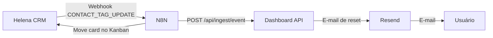

# Mapa de Integrações

## Visão Geral

## Integrações Ativas

| Serviço | Tipo | Propósito |
|---------|------|-----------|
| [[Integração N8N e Helena CRM]] | Webhook + HTTP | Ingestão de eventos de lead |
| [[Integração Resend]] | API | E-mails transacionais |
| Vercel | Deploy | Hosting do frontend |
| Railway | PaaS | Backend + PostgreSQL |
| Docker | Local | PostgreSQL de desenvolvimento |

## Fluxo Principal de Dados

1. Lead entra no CRM Helena com uma tag de etapa
2. Helena dispara `CONTACT_TAG_UPDATE` para o N8N
3. N8N mapeia a tag para a chave de etapa do dashboard (`dashKey`)
4. N8N faz `POST /api/ingest/event` com Bearer WEBHOOK_SECRET
5. Backend processa com idempotência (SHA-256)
6. Dashboard reflete o novo dado no próximo polling (30s)
