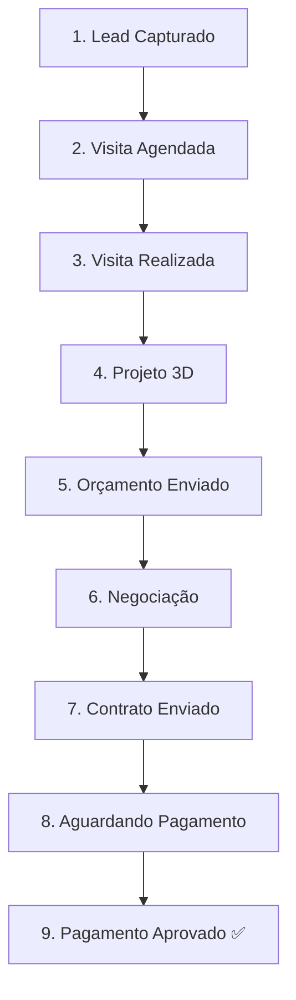

# Funil de Vendas

## As 9 Etapas



## Tabela Completa

| # | Chave | Label | Tipo |
|---|-------|-------|------|
| 1 | `lead_capturado` | Lead Capturado | Entrada |
| 2 | `visita_agendada` | Visita Agendada | Progressão |
| 3 | `visita_realizada` | Visita Realizada | Progressão |
| 4 | `projeto_3d` | Projeto 3D | Progressão |
| 5 | `orcamento_enviado` | Orçamento Enviado | Progressão |
| 6 | `negociacao` | Negociação | Progressão |
| 7 | `contrato_enviado` | Contrato Enviado | Progressão |
| 8 | `aguardando_pagamento` | Aguardando Pagamento | Progressão |
| 9 | `pagamento_aprovado` | Pagamento Aprovado | **Ganho** |

## Métricas por Etapa

O dashboard calcula para cada etapa:
- **Contagem** de leads atualmente nessa etapa
- **Taxa de conversão** para a próxima etapa (%)
- **Tempo médio** em dias nessa etapa
- **Flag de gargalo** se conversão < 50%

## First Response Time

Calculado automaticamente quando o lead sai de `lead_capturado`:
```
firstResponseMinutes = (occurredAt - enteredAt) / 60
```

Exibido em minutos (< 60) ou horas (≥ 60) no card de KPI.

## Event Sourcing

Cada transição de etapa gera um `LeadEvent` imutável:
```
Lead: id=X, currentStageId=E5 (orçamento_enviado)
  ↑
LeadEvent: fromStage=E4, toStage=E5, occurredAt=2024-01-15
LeadEvent: fromStage=E3, toStage=E4, occurredAt=2024-01-12
LeadEvent: fromStage=E2, toStage=E3, occurredAt=2024-01-10
LeadEvent: fromStage=null, toStage=E1, occurredAt=2024-01-08
```

Isso permite calcular o tempo exato em cada etapa para qualquer lead.

## Integrações com a API

- **N8N → ingest** alimenta os `LeadEvent`
- **`/api/dashboard/funnel`** agrega contagens por etapa
- **`/api/dashboard/stage-time`** calcula tempo médio (raw SQL)
