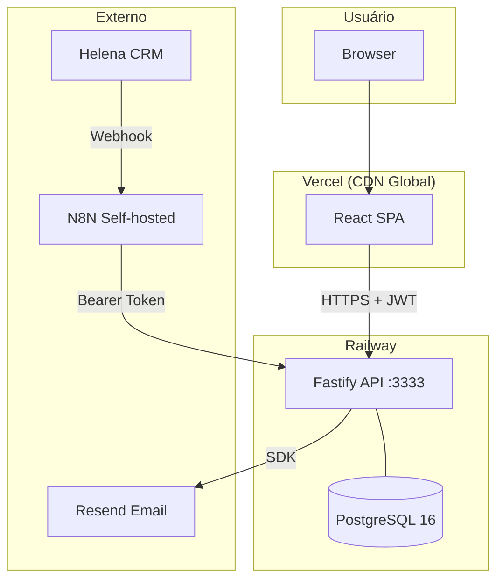

# Mapa de DevOps

## Notas de DevOps

- [[Deploy e Infraestrutura]]
- [[Variáveis de Ambiente]]
- [[Comandos Úteis]]
- [[Docker e Banco Local]]

## Ambientes

| Ambiente | Frontend | Backend | Banco |
|---------|---------|---------|-------|
| Produção | Vercel | Railway | Railway PostgreSQL |
| Desenvolvimento | localhost:5173 | localhost:3333 | Docker localhost:5432 |

## Pipelines

| Serviço | Trigger | Ação |
|---------|---------|------|
| Vercel | Push para `main` | Build + Deploy frontend |
| Railway | Push para `main` | Build Dockerfile + Deploy |

## Diagrama de Infraestrutura

